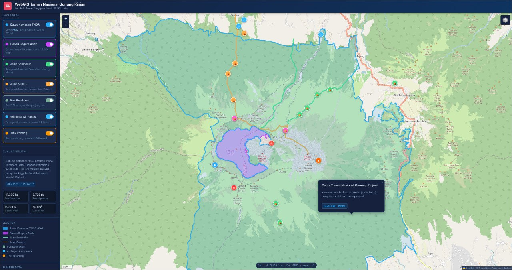

# WebGIS Taman Nasional Gunung Rinjani



Interactive WebGIS displaying **OpenStreetMap** base maps with multiple spatial data layers for Taman Nasional Gunung Rinjani, Lombok, NTB.

## Features
- Interactive map: **zoom in/out, pan**, switch base maps (OpenStreetMap / Topographic / Esri Satellite), **⛶ fit-to-bounds** button
- **KML layer** for official TNGR boundary (WDPA / Protected Planet data)
- Additional **OpenStreetMap** layers: Segara Anak Lake, **Sembalun** & **Senaru** hiking trails (real geometry, winding paths), climbing **posts** & Plawangan, **tourist spots** (Sendang Gila, Tiu Kelep, Mangku Sakti waterfalls) and Aik Kalak **hot spring**
- Key markers (summit, lake, Gunung Barujari, basecamp) with popup info
- Toggle layers on/off, legend, area info, coordinate display & zoom level
- Responsive: on mobile, layer panel becomes a drawer (☰ button)

## How to run
Since the page loads `.kml`/`.geojson` files, run via a **local server** (not double-click) so KML layers load properly:

```bash
# from this folder
python3 -m http.server 8000
```
Then open in browser: <http://localhost:8000>

> Alternatively: in VS Code use the **Live Server** extension → click "Go Live".

If opened via double-click (`file://`), the map still works using the `data.js` fallback, but a server is recommended for native KML loading.

## File structure
| File | Description |
|------|-------------|
| `index.html` | Main page + map logic (Leaflet) |
| `style.css` | Styling |
| `rinjani.kml` | **KML layer** - official TNGR boundary (source: WDPA / Protected Planet) |
| `segara_anak.geojson` | Segara Anak Lake (OpenStreetMap) |
| `sembalun_trail.geojson` | Sembalun hiking trail (OSM) |
| `senaru_trail.geojson` | Senaru hiking trail (OSM) |
| `pos_pendakian.geojson` | Climbing posts & Plawangan (OSM) |
| `poi_wisata.geojson` | Waterfalls & hot spring (OSM) |
| `data.js` | All layers copied (offline fallback), generated by `build_data.py` |
| `rinjani_boundary.geojson` | Raw TNGR boundary data (WDPA) |
| `build_data.py` | Script to generate `rinjani.kml` & `data.js` |

## Data sources
- Boundary: **WDPA / Protected Planet** (Gunung Rinjani, IUCN cat. II, ~41,330 ha)
- Lake, trails (Sembalun & Senaru), posts, waterfalls & hot spring: **OpenStreetMap**
  (fetched via Overpass API; hiking route relations 17259217 & 17259241)
- Base maps: © OpenStreetMap contributors; satellite © Esri; topographic © OpenTopoMap
